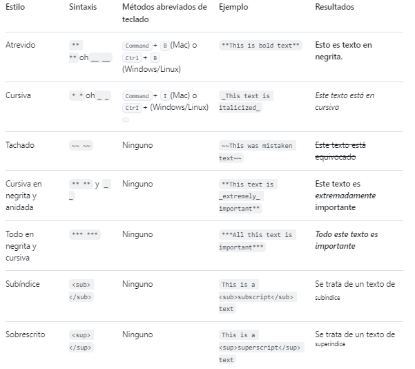
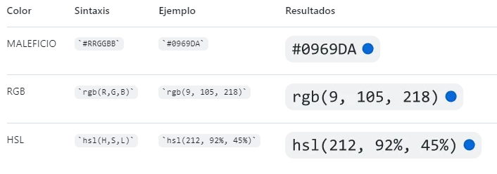

ESTE ES EL MANUAL MD

# Sintaxis de escritura y formato básicos
Para crear un encabezado, agrega entre uno y seis símbolos # antes del encabezado del texto. El número de # que utilices determinará el nivel jerárquico y el tamaño tipográfico del encabezado.

# "# PRIMER NIVEL"
## "## SEGUNDO NIVEL"
### "### TERCER NIVEL"

# Estilos de texto
Puedes indicar énfasis con texto en negrita, cursiva, tachado, o de subíndice o superíndice en los campos de comentarios y archivos .md.



# Entrecomillado de texto
Puede entrecomillar texto con >.

> texto entrecomillado

# Código de cita
Puedes indicar un código o un comando dentro de un enunciado con comillas simples. El texto dentro de las comillas simples no será formateado. También puedes presionar el método abreviado de teclado Comando+E (Mac) o Ctrl+E (Windows o Linux) para insertar las comillas simples de bloque de código en una línea de Markdown.

Ejemplo `git status` para citar partes del texto.

Para formatear código o texto en su propio bloque distintivo, usa comillas triples.

Algunos comandos básicos de Git son:
```
estado de git
agregar git
git comprometerse
```
# Modelos de color compatibles
En los problemas, las solicitudes de incorporación de cambios y los debates, puedes llamar a los colores dentro de una oración mediante comillas simples. Un modelo de color compatible dentro de las comillas simples mostrará una visualización del color.

The background color is `#0969DA` for light mode and `#000000` for dark mode.

Estos son los modelos de color admitidos actualmente.


# Vínculos
Puede crear un vínculo en línea escribiendo su texto entre corchetes [ ] y escribiendo la URL entre paréntesis ( ). También puede usar el método abreviado de teclado Command+K para crear un vínculo. Cuando haya seleccionado texto, puede pegar una dirección URL del Portapapeles para crear automáticamente un vínculo a partir de la selección.

También puedes crear un hipervínculo de Markdown resaltando el texto y usando el método abreviado de teclado Comando+V. Si quieres reemplazar el texto por el vínculo, usa el método abreviado de teclado Comando+Mayús+V.

A continuacion se mostrará un link: [ejemplo de link](https://www.vavel.com/colombia/data/luis-diaz/bio/).

# Vínculos relativos
Puedes definir enlaces relativos y rutas de imagen en los archivos representados para ayudar a que los lectores naveguen hasta otros archivos de tu repositorio.

Un enlace relativo es un enlace que es relativo al archivo actual. Por ejemplo, si tiene un archivo Léame en la raíz del repositorio y tiene otro archivo en docs/CONTRIBUTING.md, el vínculo relativo a CONTRIBUTING.md en el archivo Léame podría tener este aspecto:

[Contribution guidelines for this project](docs/CONTRIBUTING.md)

GitHub transformará de manera automática el enlace relativo o la ruta de imagen en cualquier rama en la que te encuentres actualmente, de modo que el enlace o ruta siempre funcione. La ruta de acceso del vínculo será relativa al archivo actual. Los vínculos que comienzan por / serán relativos a la raíz del repositorio. Puede usar todos los operandos de vínculo relativos, como ./ y ../.

Los enlaces relativos son más sencillos para los usuarios que clonan tu repositorio. Puede que los enlaces absolutos no funcionen en los clones de tu repositorio. Recomendamos usar enlaces relativos para consultar los archivos dentro de tu repositorio.

# Imágenes
Puede mostrar una imagen agregando ! y ajustar el texto alternativo en [ ]. El texto alternativo es un texto corto equivalente a la información de la imagen. Luego, escribe el vínculo de la imagen entre paréntesis ().


GitHub admite la inserción de imágenes en incidencias, solicitudes de incorporación de cambios, debates, comentarios y archivos .md. Puedes mostrar una imagen desde tu repositorio, agregar un enlace a una imagen en línea o cargar una imagen.

# Listas
Puedes crear una lista sin ordenar. Para ello, coloca -, * o + antes de una o más líneas de texto.

- Messi (GOAT)
* Cristiano Ronaldo
+ Pelé

Para ordenar tu lista, antecede cada línea con un número.

1. Luis Diaz
2. Falcao Garcia 
3. James Fodriguez

# Listas anidadas
Puedes crear una lista anidada al dejar sangría en uno o más elementos de la lista debajo de otro elemento.

Para crear una lista anidada mediante el editor web en GitHub o un editor de texto que usa una fuente monoespaciada, como Visual Studio Code, puedes alinear la lista visualmente. Escribe los caracteres con espacio frente al elemento de la lista anidada hasta que el carácter del marcador de lista (- o *) se encuentre directamente debajo del primer carácter del texto en el elemento que se encuentra debajo.

1. Ejemplo de listas seguidas 
   - lista seguida 1
     - lista seguida 2

# Listas de tareas
Para crear una lista de tareas, debe añadir como prefijo un guion y espacio, seguido de [ ] a los elementos de la lista. Para marcar una tarea como completada, use [x].

- [x] #739
- [ ] https://github.com/octo-org/octo-repo/issues/740
- [ ] Add delight to the experience when all tasks are complete :tada:

Si la descripción de un elemento de la lista de tareas comienza por un paréntesis, necesitará agregar el carácter de escape \:

- [ ] \(Optional) Open a followup issue

# Usar emojis
Puedes agregar emoji a la escritura escribiendo :EMOJICODE:, dos puntos seguidos del nombre del emoji.

@octocat :+1: This PR looks great - it's ready to merge! :shipit:

# Notas al pie
Puedes agregar notas al pie para tu contenido si utilizas esta sintaxis de corchetes:

la nota quedaria de esta manera[^1].

esto es otro ejemplo[^2].

[^1]: esta es la referencia de la nota.

[^2]: de igualmanera me dirige a esta parte del texto.

# Alertas
Las alertas son una extensión Markdown basada en la sintaxis blockquote que puede utilizar para resaltar la información crítica. En GitHub, se muestran con colores e iconos distintivos para indicar la importancia del contenido.

Deben usarse las alertas solo cuando sean cruciales para el éxito del usuario y limitarlas a una o dos por artículo para evitar sobrecargar al lector. Además, debe evitarse colocar alertas consecutivamente. Las alertas no se pueden anidar dentro de otros elementos.

Para agregar una alerta, debe usarse una línea blockquote especial que especifique el tipo de alerta, seguida de la información de alerta en un blockquote estándar. Existen cinco tipos de alertas.

> [!NOTE]
> Useful information that users should know, even when skimming content.

> [!TIP]
> Helpful advice for doing things better or more easily.

> [!IMPORTANT]
> Key information users need to know to achieve their goal.

> [!WARNING]
> Urgent info that needs immediate user attention to avoid problems.

> [!CAUTION]
> Advises about risks or negative outcomes of certain actions.

# Ocultar el contenido con comentarios
Puedes decirle a GitHub que oculte el contenido del lenguaje de marcado interpretado colocando el contenido en un comentario de HTML.

<!-- Este contenido no aparecerá en el Markdown renderizado -->

# Ignorar formato de Markdown
Puede pedirle a GitHub que ignore (u omita) el formato de Markdown escribiendo \ antes del carácter de Markdown.

Let's rename \*our-new-project\* to \*our-old-project\*.


